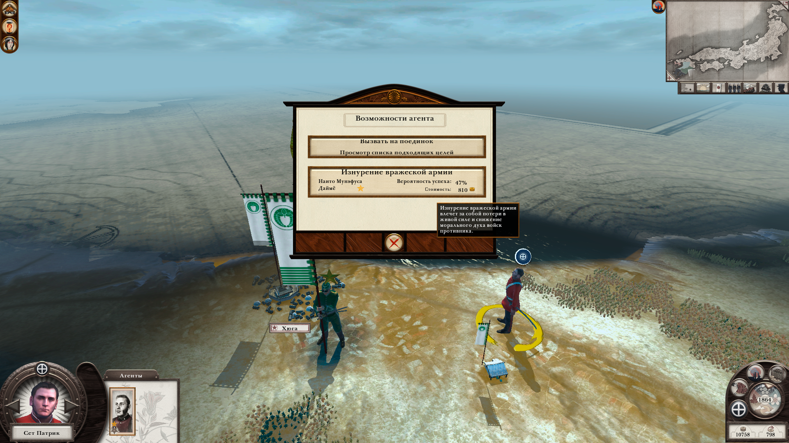
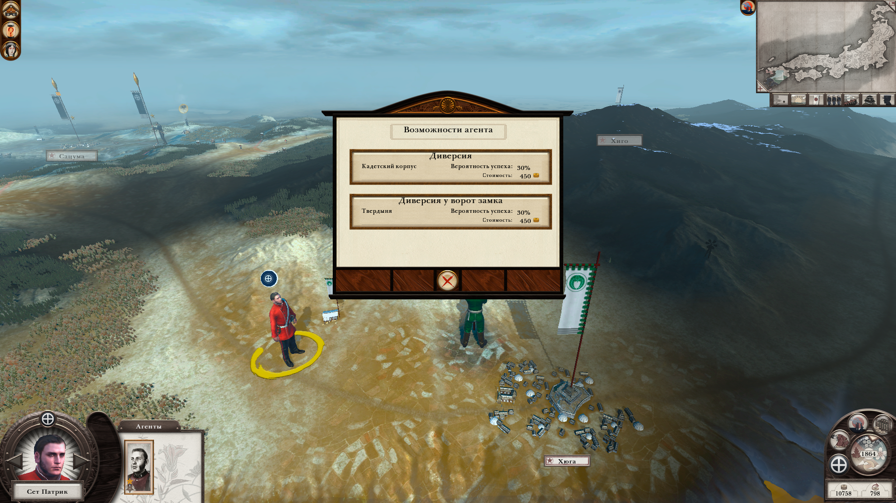

# Агенты

- [Назад](../README.md)

## Общее 

Агенты являются вспомогательными юнитами, предназначенными для решения определённых задач. Механика агентов схожа с Total War Shogun 2 и Total War Rome 2. 

Агенты могут перемещаться по карте и выполнять определённые действия. Агенты имеют очки действий, которые могут расходоваться на перемещение и выполнение задания. 

Армии не могут взаимодействовать с агентами, а агенты могут взаимодействовать с армиями и другими агентами. Некоторые действия агентов требуют денежных  затрат. 

Количество агентов разного типа ограничено, для увеличения лимита необходимо строить постройки определённого типа.

## Виды агентов

Агенты бывают:
- Разведчик (исследует территории, собирает информацию, может совершать диверсии, невидим для врага)
- Убийца
- Авантюрист
- Колонист (исследует территории, может основывать столицы провинций, видим для всех)
- Посол (может налаживать отношения с племенами, видим для всех)
- Миссионер (может обращать племена в свою веру, может обращать провинции в свою веру)
- Инквизитор

---
© 2025 Вадим Бельский (bielski.vadim@gmail.com)