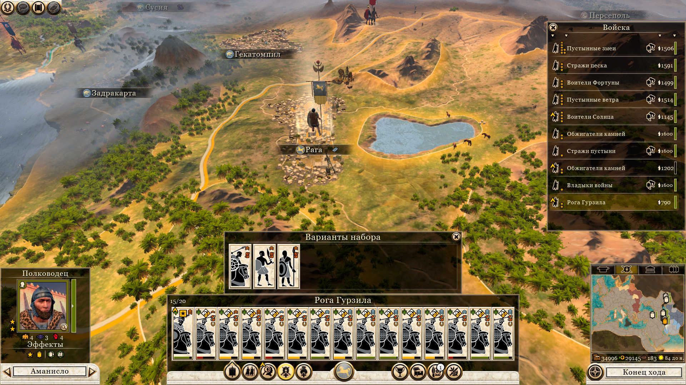
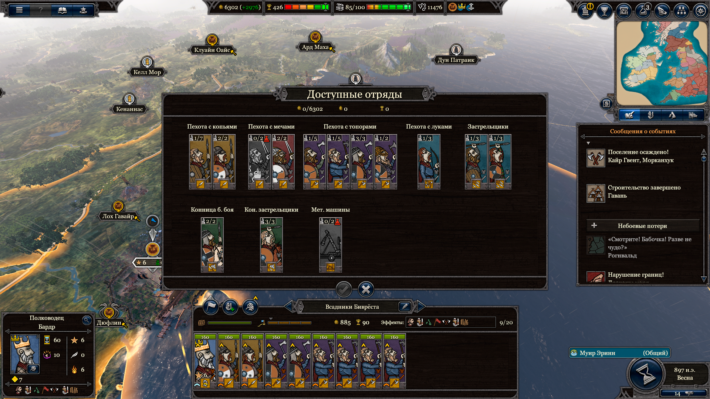
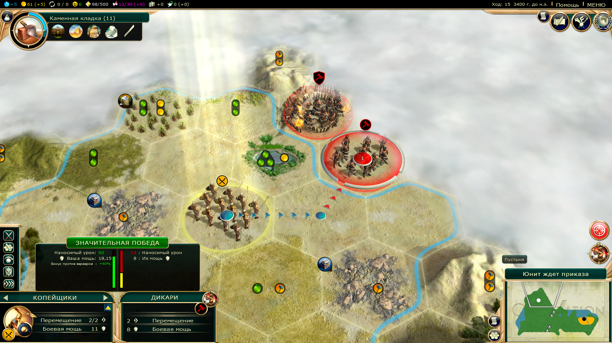
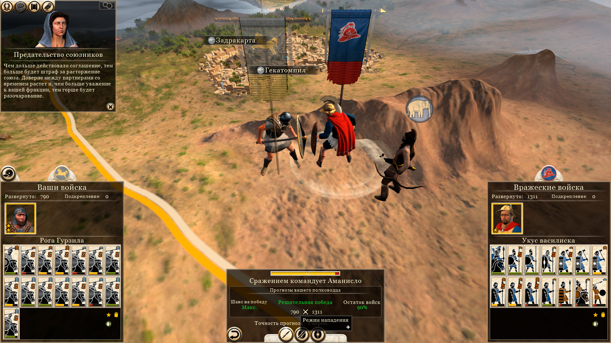
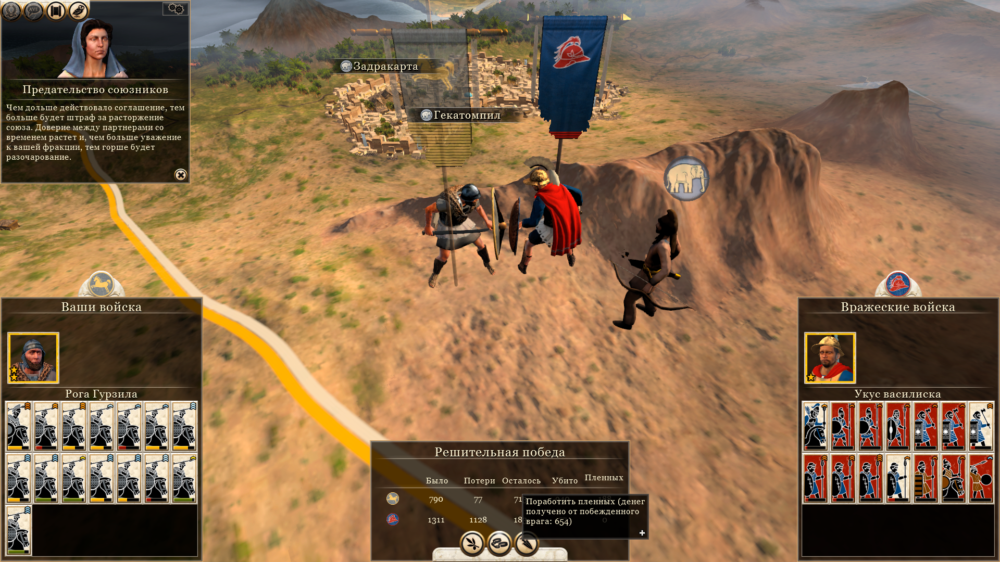
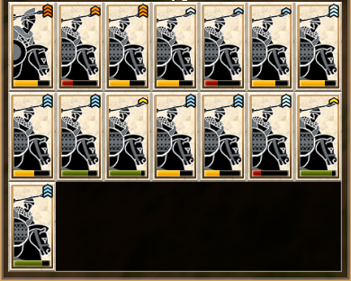

# Армия

- [Назад](../README.md)

## Армии

Боевая система схожа с играми Total War. Основной боевой единицей служит воинское подразделение (армия).  В воинское подразделение можно добавлять отряды солдат. Во главе армии стоит генерал (главнокомандующий). Количество отрядов в воинском подразделении ограничено, и зависит от технологий и навыков полководца.

У армии есть очки действий, которые расходуются при выполнении приказов, например перемещения. Некоторые приказы требуют чтобы было хотя бы одно очко действий а некоторые чтобы очки действий были полными.

Армии обладают зоной контроля в которой затруднено перемещение армий противника.

## Создание армии

Наем войска схож с Total War. Сформировать армию и добавить в неё отряды можно только в столице вашей провинции. Армия создается мгновенно. После создания армии, в неё необходимо добавить отряды. На формирование отрядов необходимо от 1 до 3 ходов (в зависимости от отряда).  

# Перемещение, атака, приказы

Для перемещения по карте требуется наличие хотя бы одного очка действий, а количество потраченных на это очков зависит от рельефа и климата клетки.

Атака требует наличия хотя бы одного очка действий и расходует их все (как в Civilization 5) 

Армии, расположенные рядом могут обмениваться отрядами, для этого необходимо хотя бы одно очко действий у обоих армий, это действие тратит все очки действий у обеих армий.

## Сражение

Механика сражения схожа с Total War Rome 2. Сражение между армиями рассчитывается автоматически. В сражение вовлекаются все соседние армии.

## Боеспособность отрядов

У отрядов есть характеристика, показывающая усталость отрядов в армии. Она изменяется в результате выполнения различных действий. Его упадок приводит к снижению боевых характеристик, очков действий и возможному дезертирству.

Нехватка ресурсов на содержание отрядов резко уменьшает боеспособность. Боеспособность можно восстановить выполнив приказ отдых. Для него требуется чтобы очки действий были полными и они расходуются все, а так же было достаточно ресурсов для снабжения отряда. В это время очень сильно снижаются боевые характеристики отрядов, армия на отдыхе уязвима.

## Пополнение отрядов

Отряды не восстанавливают свою численность сами по себе.

На пополнение отрядов требуются ресурсы. Начать пополнение отрядов можно определённым приказом для армии, для этого необходимо чтобы все очки действий были полными, данное действие расходует все очки действий. Отряды пополняются за один ход. Пополнение отрядов возможно только на дружественной территории. Во время пополнения отрядов, они восстанавливают свои боеспособность до максимума. 

## Типы армий

При создании армии можно выбрать её тип. Тип армии ограничивает набор отрядов, которые могут в ней находиться. 

Типы армий:
- Сухопутная
- Флот

## Боевой опыт

Во время сражения, армия получает боевой опыт (в зависимости от количества уничтоженных противников), который делить поровну между всеми отрядами. Отряды получая опыт, прокачиваются (как в Total War), повышая свой ранг. Само подразделение формирует воинские традиции (подобно тому как это происходит в Total War). Доступные традиции открываются в дереве социальных технологий. В случае гибели всей армии, её традиции утрачиваются навсегда.

## Зона контроля

Вокруг армий и городов имеется зона контроля. Перемещение в зоне контроля вражеской армии (из клетки в зоне контроля в другую клетку в зоне контроля) тратит все очки действий. Данная механика схожа с Civilization 5.

## Перевооружение

Отряды можно перевооружить на более современное оружие и организацию в регионах где доступен найм таких новых отрядов. Перевооружение требует денег и ресурсов, а так же полных очков действий, занимает один ход.

Перевооружённые отряды полностью сохраняют боевой опыт (ранг).

## Укрепления

Укрепления (постройки) дают бонусы к обороне на этой клетки, укрепления могут быть повреждены в бою. Укрепления могут быть разрушены и со временем устаревают.

---
© 2025 Вадим Бельский (bielski.vadim@gmail.com)