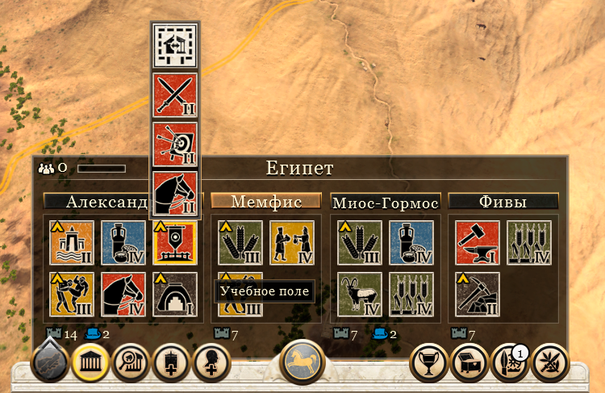

# Улучшения клеток (постройки)

- [Назад](../README.md)

## Общее 

Улучшения клеток (постройки) позволяют использовать клетку для добычи или переработки ресурсов. Для начала строительства нужно определённое количество денег и / или других ресурсов. Постройки открываются технологиями, традициями, религиозными догматами, принятыми законами. Постройку можно улучшить в постройку следующего уровня.

Некоторые постройки, размещенные на соседних клетках могут давать бонусы по аналогии с районами в Civilization 6. 

Содержание некоторых построек требует денег или других ресурсов. Некоторые постройки могут опционально потреблять дополнительные ресурсы и за это давать дополнительные бонусы.

## Механика строительства улучшений

Механика строительства схожа с игрой Total War Rome 2. Все постройки (и места под строительства новых) в провинции отображаются на одной вкладке (как в Total War Rome 2). Строительство требует денег и других ресурсов и занимает несколько ходов. Постройки можно улучшать до следующего уровня, на улучшение требуется меньше денег, и она строится она быстрее. 

## Назначения построек

Постройки разделяются на (по аналогии с Total War Rome 2 отличаются по цвету):
- Сельскохозяйственные (крестьяне)
- Промышленные (рабочие)
- Экономические (купцы)
- Религиозные (духовенство)
- Военные (солдаты)
- Административные (знать)

## Разрушение

Постройки могут быть разрушены во время военных действий или по другим причинам. Если ХП постройки равно 100% она считается целой и работает в обычном режиме. Если ХП постройки больше 50 но меньше 100, она считается поврежденной и дает меньше бонусов. Если ХП постройки меньше 50 то она считается разрушенной и не дает бонусов, но её можно восстановить за деньги. Восстановление один ход. Если ХП постройки равно 0 то она превращается в руины, которые можно только снести.

## Города и городские постройки

Город (центр города) представляет собой особое улучшение клетки, рядом с которым можно строить городские постройки (кварталы / пригороды). Такие постройки могут быть размещены только рядом с центром города или другим городским кварталом, количество кварталов и возможный радиус удаления от центра города определяется уровнем города (тиром его городской постройки).

## Потребление и производство ресурсов постройками

Если постройка не может в этот ход израсходовать необходимые ей ресурсы, то она не производит ресурсы и не даёт никаких бонусов за исключением модификатора обороны.

---
© 2025 Вадим Бельский (bielski.vadim@gmail.com)