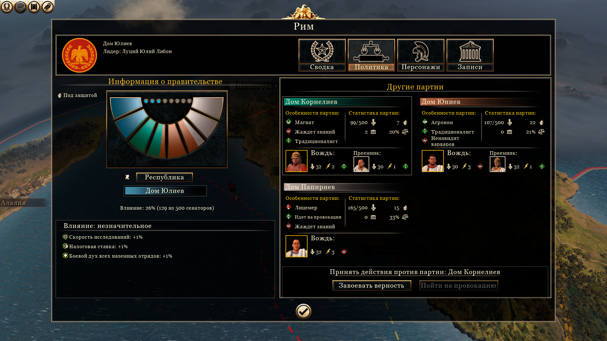
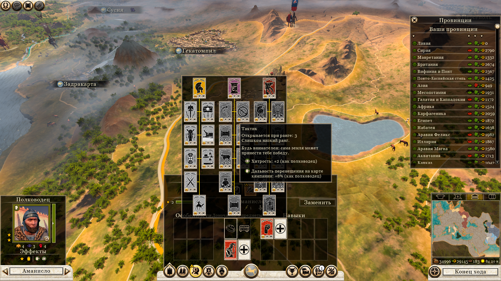

# Дома (кланы)

- [Назад](../README.md)

## Персонажи

На важные должности (губернатор, генерал, агент, министр) можно назначать персонажей для получения дополнительных бонусов. Поскольку персонажи очень быстро умирают (даже в том же Total War Rome 2), они представлены не личностями, а их родами (семьями, кланами, домами). Считается что наследник автоматически занимает должность, которая передается ему по наследству. Дом может содержать несколько персонажей, количество персонажей, которые принадлежат дому, называется его текущим размером, а количество персонажей, до которого может увеличиться количество персонажей в этом доме, называется максимальным размером дома. Дом увеличивает свой размер на 1 раз в несколько ходов, пока его размер не достигнет максимального. Гибель персонажа на посту или его снятие с поста уменьшает размер дома на 1. Максимальный размер дома можно увеличить прокачкой навыков дома (особенностей). 

Если текущий размер дома уменьшается до 0, дом исчезает.

## Символика и характеристики дома

Дома имеют своё название и герб. Дома обладают культурой и религией. Культура дома определяется при образовании дома. Религию дома можно изменить миссионером. 

## Старший дома

Дом, персонаж которого занимает должность главы государства, считается старшим, за что получает постоянный бонус к максимальному размеру (+1). Правящие династии возникают с началом игры и управляют начальными государствами, или превращаются из младших домов, если их персонаж занимает должность главы государства.

## Младшие дома

Младший дом может возникнуть из знати в случае дарования ей должности. Обычно должность даруют столичной знати или местной знати. Такой младший дом получит такую же культуру и религию, которая наиболее распространена в провинции, человеку из которой даровалась должность. Также младший дом может возникнуть если человек совершит какое-то значимое действие, например поднимет и возглавит восстание. 

Младшие дома имеют показатель лояльности (верности) к старшему дому. Он изменяется при назначении персонажа из этого дома на должность и снятии с его с должности, при его успехе или неудаче на занимаемых должностях, гибели на работе или внешнем воздействии и других событиях.  

## Династический брак

Династический брак заключается старшим и младшим домом и увеличивает повышение лояльности и замедляет снижение. Одновременно может быть только один династический брак (возможно увеличение с помощью открытия определённых особенностей у старшего дома).

## Развитие дома

За каждую занимаемую должность (и дополнительно успешные действия на ней) дом получает опыт, за который увеличивается его уровень, за увеличение уровня можно прокачать навык дома. Навыки увеличивают бонусы, которые дает назначенный на должность персонаж из этого дома.

## Предательство нелояльных династий

Если лояльность младшего дома падает, он может поднять восстание, в таком случае он образует новое государство и станет старшим домом в нём. В случае восстания, на сторону мятежников могут перейти все другие нелояльные дома. Все провинции с губернаторами из мятежных домов перейдут под контроль мятежного государства. Все армии с генералами из мятежных династий перейдут на сторону мятежного государства. Все агенты из мятежных династий перейдут на сторону мятежного государства. Остальные персонажи из мятежных династий покинут свои должности в оставшихся под контролем изначального государства провинциях.

---
© 2025 Вадим Бельский (bielski.vadim@gmail.com)