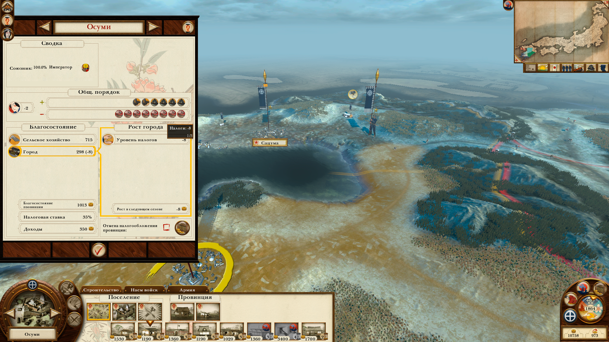

# Жители

- [Назад](../README.md)

## Сословия

Все жители разделены на сословия, которые делятся на две группы:
- простолюдины (около 90%)
- привилегированные сословия (около 10%)

К простолюдинам относятся:
- крестьяне
- рабочие

К привилегированным сословиям относятся:
- знать
- духовенство
- купцы
- солдаты

Представители привилегированных сословий потребляют больше ресурсов чем простолюдины и получают их в приоритете. Каждая постройка даёт определенное количество жителей определенного сословия.

## Потребление пищи и уплата налогов

Каждый житель потребляет пищу, привилегированные сословия потребляют значительно больше пищи. Нехватка пищи приводит к голоду, а её изобилие к дополнительными бонусам (как  в Total War Saga: Thrones of Britannia).

Каждый житель платит налоги, если для его сословия они включены и снижает общественный порядок из-за недовольства налогами.

---
© 2025 Вадим Бельский (bielski.vadim@gmail.com)