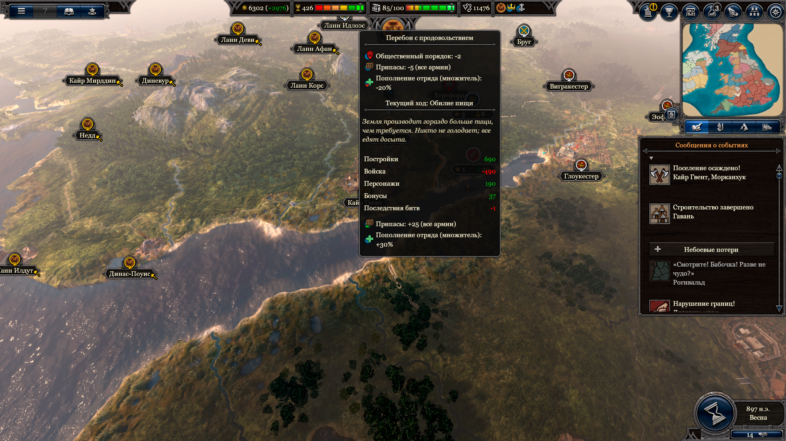

# Ресурсы

- [Назад](../README.md)

## Общее

Ресурсы добываются или перерабатываются постройками на определённых клетках и могут быть потрачены на разные цели. 

Ресурсы могут накапливаться в хранилищах у некоторых построек, размер хранилищ ограничен. Разрушение постройки с хранилищем приводит к уничтожению этих ресурсов.

## Месторождения ресурсов

На клетках могут располагаться месторождения ресурсов (плодородная почва, леса, рыба, дикие животные, полезные ископаемые). Леса можно вырубить, получив сразу большое количество древесины.

Богатство месторождения:
- Бедное (-50%)
- Обычное (+0%)
- Богатое (+100%)

Наличие ресурсов на клетках позволяет создавать на этих клетках определённые постройки для добычи этих ресурсов.

## Распределение ресурсов

Различные постройки, армии, жители и другие варианты траты ресурсов имеют разные приоритеты. Например, пищу сначала получают жители из привилегированных сословий, а затем простолюдины, и в случае нехватки пищи первыми будут голодать простолюдины. Ресурсы распределяются сначала в более развитых провинциях.

## Рабы

Рабы являются ресурсом. Рабов можно захватить во время войны, обратив жителей разграбленных клеток или солдат побежденных армий в рабство. Рабы потребляются сельскохозяйственными постройками. 

## Пища

Один из основных ресурсов, актуальный на протяжении всей игры. Она не может накапливаться, её избыток дает экономике дополнительные бонусы, а недостаток штрафы (как в Total War Saga: Thrones of Britannia).

## Примеры ресурсов

Пища, золото, древесина, камень, железо, сталь, медь, бронза, уголь, нефть, креозот, порох, электроэнергия

---
© 2025 Вадим Бельский (bielski.vadim@gmail.com)