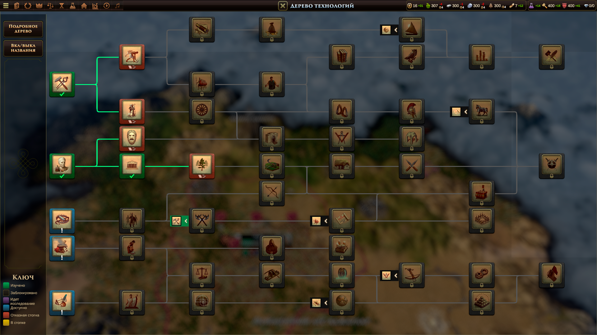

# Наука и развитие

- [Назад](../README.md)

## Дерево исследований

Технологии открываются за очки открытий, которые даются раз в несколько ходов, а также за создание определенных построек или другие значимые достижения. Дерево технологий похоже на дерево талантов из World of Warcraft Classic. У некоторых технологий есть несколько уровней, которые дают дополнительные бонусы, для открытия некоторых технологий нужно чтобы некоторые другие были открыты, доступ к открытию более продвинутых технологий открывается после открытия определенного числа более ранних технологий (как в дереве талантов в WoW).

## Эпохи

Игра разделена на 3 эпохи:
- Средневековье;
- Возрождение;
- Новое время.

---
© 2025 Вадим Бельский (bielski.vadim@gmail.com)