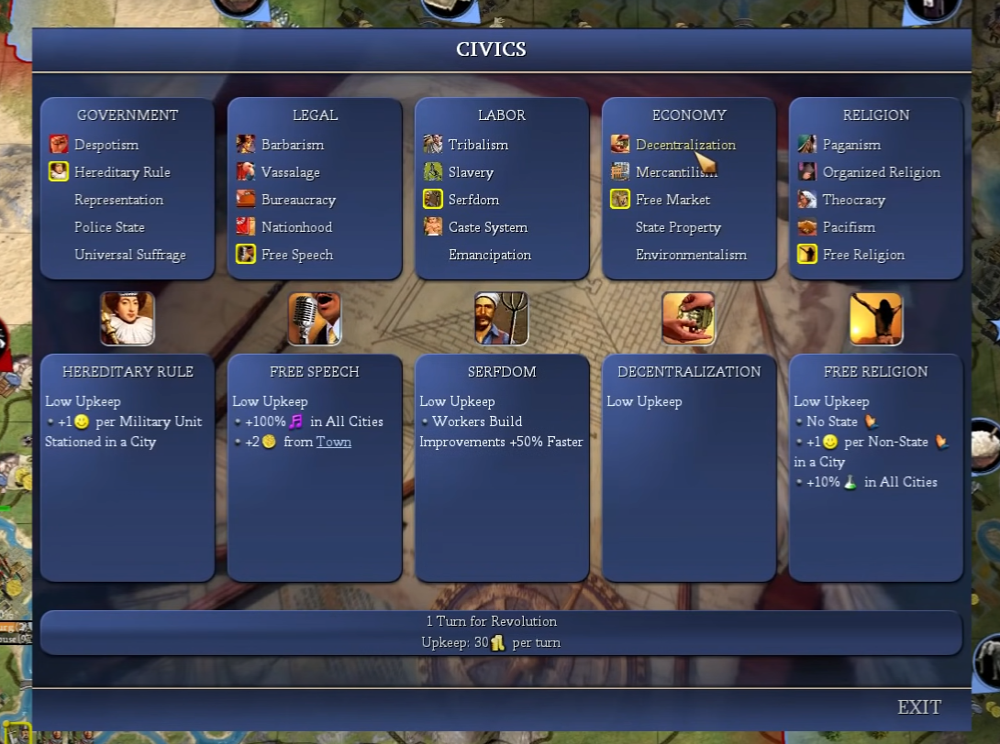
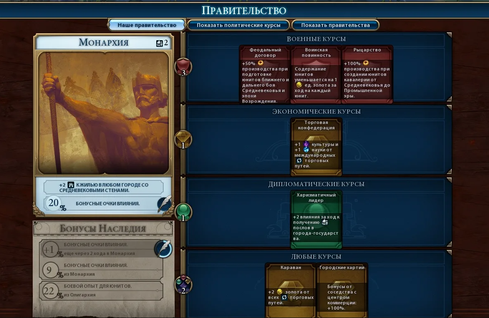
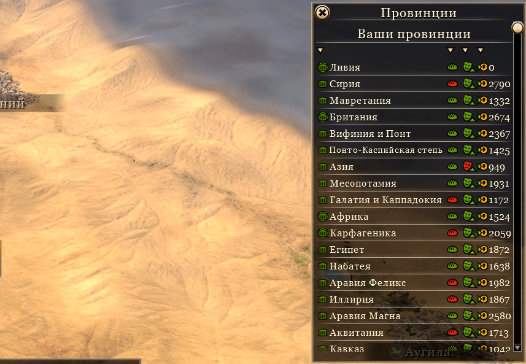
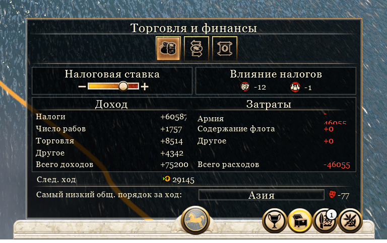
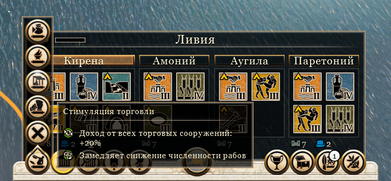
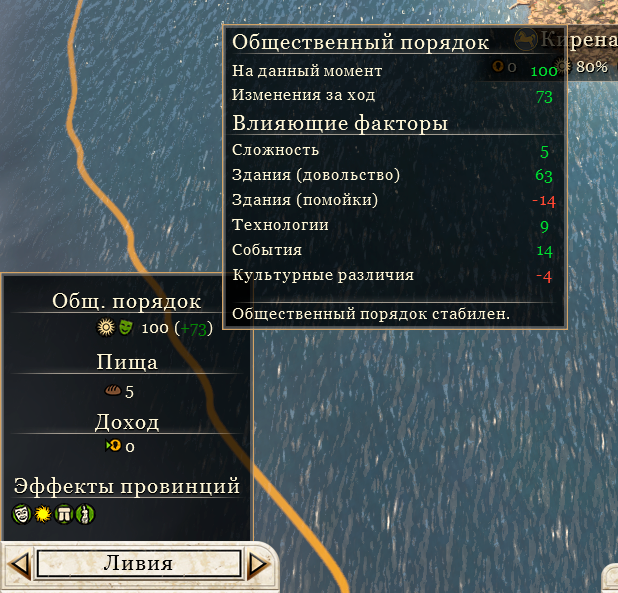

# Государство

- [Назад](../README.md)

## Государственный строй

Государственной строй определяется 4-мя специализированными карточками (схожими с "цивиками" из Civilization 4), дающими сильный бонус. Изменения этих карточек требуют денежных затрат, которые зависят от размера государства. 

Государственный строй:
- Власть (кто участвует в обсуждении и принятии законов)
- Армия (кто и почему служит в армии)
- Экономика (как государство регулирует экономическое взаимоотношения жителей)
- Общество (как государство относится к гражданам)

Новые карточки открываются в дереве социальных институтов.

Примеры карточек государственного строя:
- Политика: абсолютная монархия, феодальный строй, теократия, аристократия, олигархия, технократия, фейковая демократия
- Армия: ополчение, профессиональная армия, наемники, воинская повинность
- Экономика: рабовладельческий строй, крепостное право, трудовая повинность
- Общество: традиции предков, религиозное государство, светское государство, атеизм

## Эдикты

Эдикты - это правительственные указы, которые дают бонус действующий на всё государство. Представляют собой систему карточек, похожую на механику политических курсов в Civilization  6 (но только без разделения на разные типы). 

Эдикты можно изменить в любой момент (один раз за ход). Эдикты открываются в дереве социальных институтов.

Количество указов зависит от государственного строя и других факторов.

## Провинции

Территория государства поделена на провинции, границы которых определяются при генерации мира. В состав государства может входить множество провинций. Новые территории можно присоединить колонизировав незанятую провинцию или получив провинцию от другого государства. У провинции есть список религий и культур, распространенных в ней.

## Налоги

Размер налогов устанавливается для всех провинций и сословий единый: нет налогов, низкие налоги, средние налоги, высокие налоги.

Для каждого сословия можно отдельно отменить налоги. Для каждой провинции можно отдельно отменить налоги, в такой провинции налоги с жителей не взимаются.

Налоги влияют на уровень общественного порядка.

## Губернаторы

Провинцией управляется губернатор, принадлежащий к одной из семей высшей знати.  Губернатор дает провинции определенные бонусы, которые зависят от навыков его семьи.

Глава государства может издавать указы для губернатора провинции, такие указы дают сильный бонус в этой провинции. 

Если губернаторы из рядом расположенных провинций принадлежат одному дому, они дают дополнительный бонус своей провинции за каждую соседнюю провинцию с губернатором из того же дома.

## Указы наместникам

Указы наместникам, представляют собой распоряжения выданные правительством государства главам регионов. Для каждой провинции можно выдать только один указ. Указ даёт сильный бонус, который действует только на эту провинцию. Указы можно изменить в любой момент (один раз за ход). Система похожа на механику эдиктов из Total War Rome 2.

Новые указы открываются в дереве социальных институтов.

## Общественный порядок

Уровень общественного порядка в провинции показывает насколько население подчиняется её властям. На уровень общественного порядка влияют налоги, расположенная там армия, улучшения клеток, эдикты и указы, государственный строй, культура и религия, и т.д..

При низком общественном порядке на провинцию экономику в провинции накладываются штрафы. Если уровень общественного порядка достигает предела, в провинции может подняться восстание простолюдинов, возглавляемых представителями местной знати.

## Столица государства

В столице доступны уникальные столичные улучшения, которые нельзя создавать в других городах, они дают сильные бонусы, которые могут действовать на всей территории государства сразу. Столица государства получает дополнительные бонусы к размеру города.

---
© 2025 Вадим Бельский (bielski.vadim@gmail.com)