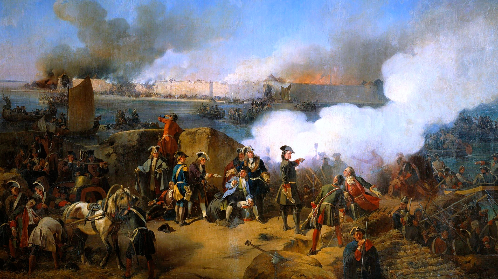

# MyCivGame

Глобальная пошаговая стратегия, в которой игроку предстоит взять на себя роль главы государства и дипломатическим, экономическим и военным путем добиться мирового господства. Игра вдохновлена сериями Civilization и Total War, сочетая в себе процедурно сгенерированный мир с гексагональной картой из первого и экономическую и боевую систему из второго, рассказывая альтернативную историю человечества от средних веков до начала двадцатого столетия.

## Династии

Особенностью игры является необходимость управления взаимоотношениями дворянских династий друг с другом внутри государства, поскольку их представители занимают важные должности в управлении государством и разлад в правящих кругах может привести к саморазрушению и распаду государства, за которым последует большое количество жертв.

## Религия и культура

Религия и культура играют важные роли в жизни общества, грамотное управление церковью и взаимодействие с обществом является одной из основ стабильности и развития вашего государства.

## Дипломатия

Взаимодействие с другими государствами является одним из самых важных аспектов игры, поскольку именно оно лежит на пути к достижению мирового господства. Государства стремятся поставить в зависимость от себя другие государства, чтобы усилить своё влияние на мировой арене.

## Экономика

Экономика служит фундаментом вашего государства на пути к мировому господству. Для достижения своих целей вашему государству будет необходимо выстроить надежную основу на которую оно сможет опереться в сложной ситуации.

## Армии и агенты

Армии необходимы для прямого давления на ваших конкурентов, поскольку победы на полях боя позволят вам отстаивать интересы невзирая на мнения других, агенты же позволят вести закулисную игру, не привлекая к этому большое внимание и проливая меньше крови.   

## Платформы

- Desktop (Windows, Linux)

## Инструменты

- Godot Engine, C#

## Жанры

- Глобальная пошаговая стратегия

## Референсы

- Civilization IV
- Civilization V
- Civilization VI
- Old World
- Total War: Shogun 2 - Fall Of The Samurai
- Total War: Rome 2
- Total War Saga: Thrones of Britannia

## Разделы

- [Мир](./Features/World.md)
- [Государство](./Features/State.md)
- [Наука](./Features//Science.md)
- [Улучшения клеток (постройки)](./Features/Buildings.md)
- [Ресурсы](./Features/Resources.md)
- [Армия](./Features/Army.md)
- [Агенты](./Features/Agents.md)
- [Жители](./Features/People.md)
- [Дома (кланы)](./Features/Clans.md)
- [Культуры](./Features/Culture.md)
- [Религия](./Features/Religion.md)
- [Дипломатия](./Features/Diplomacy.md)
- [Племена](./Features/Tribes.md)
- [Идеи на будущее](./Ideas.md) 

## Контакты

- [Ссылка на группу VK](https://vk.com/utech)
- [bielski.vadim@gmail.com](mailto:bielski.vadim@gmail.com)

---
© 2025 Вадим Бельский (bielski.vadim@gmail.com)